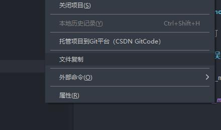

# 文件复制

> 右键 > 复制文件（夹）到【某处】

## 功能特性

* 支持文件忽略
	* 设置`工具 > 插件配置 > 文件复制`
		* 复制时是否继承`.gitignore`的设定
		* 复制时是否继承`.npmignore`的设定

## 常见问题

### 错误 EPERM: operation not permitted, symlink 'xxx' -> 'xxx'

以管理员权限启动HBuilderX即可

### node_modules复制出现错误如 Invalid src or dest: cp returned EINVAL  (cannot copy xxx ...

此问题多出现在pnpm管理的node_modules复制，现在插件内尚未做处理。

> 非必要，一般不建议复制node_modules